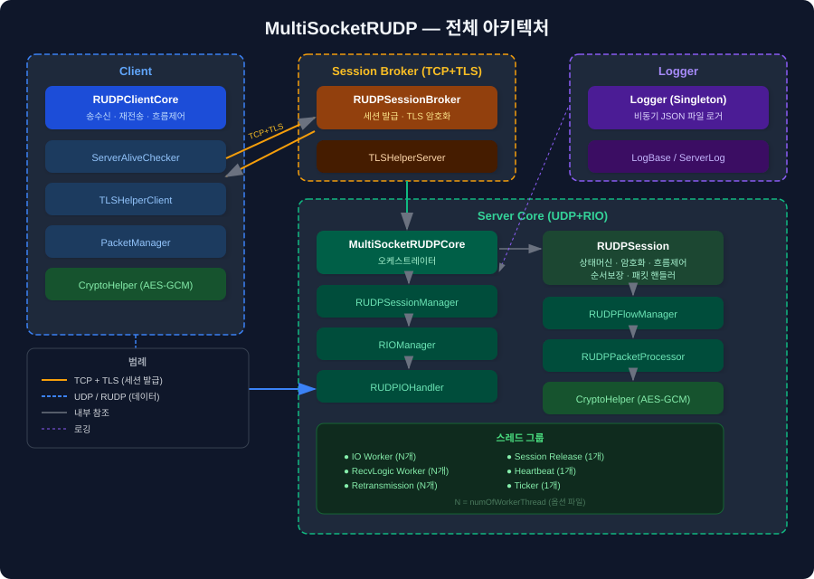

# MultiSocketRUDP & BotTester — Vault 개요

> 이 Vault는 **MultiSocketRUDP** (C++ 게임 서버 프레임워크) 와  
> **MultiSocketRUDPBotTester** (WPF 부하 테스트 도구) 의 기술 문서 모음이다.

---

## 빠른 진입점

| 목적 | 문서 |
|------|------|
| 역할·시간별 권장 읽기 순서 | [ReadingGuide](ReadingGuide.md) |
| 처음 시작 | [GettingStarted](GettingStarted.md) |
| 콘텐츠 서버 개발 | [ContentServerGuide](ContentServerGuide.md) |
| 서버 구조 전체 파악 | [MultiSocketRUDPCore](Server/MultiSocketRUDPCore.md) |
| 세션 상속 및 API | [RUDPSession](Server/RUDPSession.md) |
| 패킷 흐름 이해 | [PacketProcessing](Server/PacketProcessing.md) |
| 스레드 구조 이해 | [ThreadModel](Server/ThreadModel.md) → [WorkerThreads](Server/Threading/WorkerThreads.md) |
| 연결 오류 해결 | [Troubleshooting](Troubleshooting.md) |
| 성능 최적화 | [PerformanceTuning](PerformanceTuning.md) |
| 클라이언트 개발 | [RUDPClientCore](Client/RUDPClientCore.md) |
| BotTester | [BotTester 개요](BotTester/00_BotTester_Overview.md) |

---

## 문서 맵

---

## Server/

| 문서 | 핵심 내용 |
|------|-----------|
| [MultiSocketRUDPCore](Server/MultiSocketRUDPCore.md) | 서버 시작/종료 API, 세션 조회, 옵션 설정, 멀티소켓 구조 |
| [FatalErrorHandling](Server/FatalErrorHandling.md) | 치명 worker·RIO 오류 통지, 상위 레이어 callback, 프로세스 재시작 절차 |
| [RUDPSession](Server/RUDPSession.md) | 상속 방법, 핸들러 등록, 송신 API, 이벤트 훅, 동시성 보호 |
| [RUDPSessionBroker](Server/RUDPSessionBroker.md) | TLS 세션 발급 흐름, 실패 처리, 인증서 설정 |
| [RUDPSessionManager](Server/RUDPSessionManager.md) | 세션 풀 O(1) 할당/반환, 이중 반환 방지 |
| [SessionLifecycle](Server/SessionLifecycle.md) | 4상태 전이 다이어그램, 각 전이 조건 및 코드 |
| [SessionComponents](Server/SessionComponents.md) | 세션 하위 컴포넌트 허브와 수명 체크포인트 |
| [StateCryptoAndSocket](Server/Session/StateCryptoAndSocket.md) | 상태 전이, 암호 key handle, socket close 동기화 |
| [ReceiveContext](Server/Session/ReceiveContext.md) | RIO receive buffer, 완료 queue, 수신 객체 수명 |
| [SendAndFlow](Server/Session/SendAndFlow.md) | send queue/map, ACK·재전송 수명, CWND·pending queue |
| [PacketProcessing](Server/PacketProcessing.md) | 수신 전체 파이프라인, PacketType 분기, 순서 보장, 이상 처리 |
| [PacketFormat](Server/PacketFormat.md) | 서버 패킷 처리 기준 레이아웃과 오프셋 |
| [ThreadModel](Server/ThreadModel.md) | 스레드 문서 허브, 그룹 요약, 동시성 핵심 계약 |
| [WorkerThreads](Server/Threading/WorkerThreads.md) | IO/Logic/Retransmission/Release/Heartbeat worker별 입출력과 실패 영향 |
| [LifecycleAndSynchronization](Server/Threading/LifecycleAndSynchronization.md) | 시작·종료 순서, 공유 데이터, 객체 수명 검토 |
| [RUDPIOHandler](Server/RUDPIOHandler.md) | DoRecv/DoSend/IOCompleted, MakeSendStream 배치 전송 |
| [RIOManager](Server/RIOManager.md) | RIO 완료 큐 생성, 버퍼 등록, DequeueCompletions |
| [RUDPPacketProcessor](Server/RUDPPacketProcessor.md) | ProcessByPacketType, TPS 카운터 |
| [RUDPThreadManager](Server/RUDPThreadManager.md) | jthread 그룹 관리 |
| [SendPacketInfo](Server/SendPacketInfo.md) | 재전송 추적 구조체, RefCount, isErasedPacketInfo |
| [RetransmissionTimeoutEstimator](Server/RetransmissionTimeoutEstimator.md) | SRTT/RTTVAR 기반 RTO와 timeout backoff |
| [Ticker](Server/Ticker.md) | TimerEvent 주기 실행 |
| [MemoryTracer](Server/MemoryTracer.md) | 메모리 누수 추적 |

## Client/

| 문서 | 핵심 내용 |
|------|-----------|
| [RUDPClientCore](Client/RUDPClientCore.md) | TLS 세션 수신, UDP 연결, 송신/수신 API, 흐름 제어 |
| [RUDPSessionBroker](Client/RUDPSessionBroker.md) | 클라이언트가 수신하는 브로커 응답 형식 |
| [ServerAliveChecker](Client/ServerAliveChecker.md) | 서버 무응답 감지, deadlock 방지 설계 |

## Common/

| 문서 | 핵심 내용 |
|------|-----------|
| [CryptoSystem](Common/CryptoSystem.md) | AES-128-GCM 전체 구조, Nonce 레이아웃 |
| [CryptoHelper](Common/CryptoHelper.md) | BCrypt 래퍼와 algorithm provider 수명 |
| [PacketCryptoHelper](Common/PacketCryptoHelper.md) | EncodePacket/DecodePacket, AAD 범위 |
| [TLSHelper](Common/TLSHelper.md) | SChannel TLS 핸드셰이크와 스트림 처리 |
| [FlowController](Common/FlowController.md) | CWND, RecvWindow, advertiseWindow |

## 가이드 문서

| 문서 | 핵심 내용 |
|------|-----------|
| [ContentServerGuide](ContentServerGuide.md) | Step-by-Step 콘텐츠 서버 구현 |
| [PlayerManager](ContentServer/PlayerManager.md) | 샘플 콘텐츠 서버의 플레이어·세션 양방향 조회와 수명 주의 |
| [Troubleshooting](Troubleshooting.md) | 연결/패킷/암호화/성능 문제 해결 |
| [PerformanceTuning](PerformanceTuning.md) | 스레드/흐름제어/재전송 파라미터 최적화 |
| [GettingStarted](GettingStarted.md) | 빠른 시작 (서버+BotTester) |
| [Testing](Testing.md) | 테스트 선택 허브와 최소 실행 순서 |
| [UnitTests](Testing/UnitTests.md) | C++ CoreTest와 C# BotTester 유닛 테스트 |
| [IntegrationTests](Testing/IntegrationTests.md) | 실제 서버·클라이언트 및 C++/C# protocol 검증 |
| [CI](Testing/CI.md) | 변경 경로별 PR 검사와 필수 체크 |
| [Glossary](Glossary.md) | 용어집 |

## BotTester/

| 문서 | 핵심 내용 |
|------|-----------|
| [BotTester 개요](BotTester/00_BotTester_Overview.md) | 전체 구조, 시작 방법 |
| [BotActionGraph](BotTester/Bot/BotActionGraph.md) | TriggerType별 그래프, ActionGraphBuilder API |
| [ActionNodes](BotTester/Bot/ActionNodes.md) | 전체 노드 레퍼런스 |
| [PacketSchema](BotTester/Bot/PacketSchema.md) | 패킷 입력 필드 schema |
| [RuntimeContext](BotTester/Bot/RuntimeContext.md) | 공유 상태, 예약 키, 확장 메서드 |
| [GraphValidator](BotTester/Bot/GraphValidator.md) | 유효성 검사, 순환 감지 |
| [BotActionGraphWindow](BotTester/UI/BotActionGraphWindow.md) | 캔버스 에디터 UI |
| [AiTreeGenerator](BotTester/AI/AiTreeGenerator.md) | Gemini AI 7단계 흐름 |
| [GraphFileStorage](BotTester/Graph/GraphFileStorage.md) | 그래프 파일 저장/복원 |
| [BufferStore](BotTester/ClientCore/BufferStore.md) | 미응답 패킷과 재전송 추적 |
| [PacketLossSimulator](BotTester/ClientCore/PacketLossSimulator.md) | 양방향 UDP 손실 시뮬레이션 |

---

## Diagrams/

[다이어그램 목록](Diagrams/README.md)
