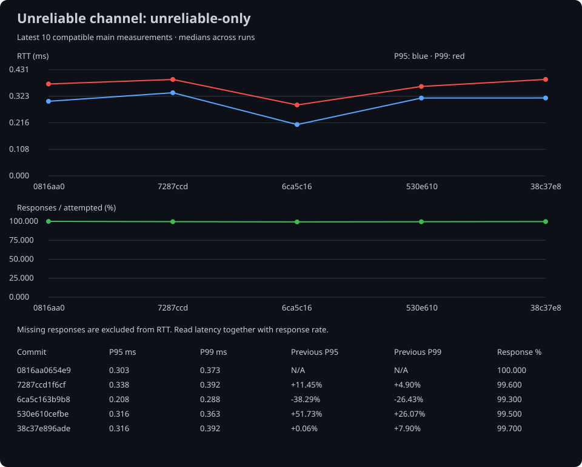
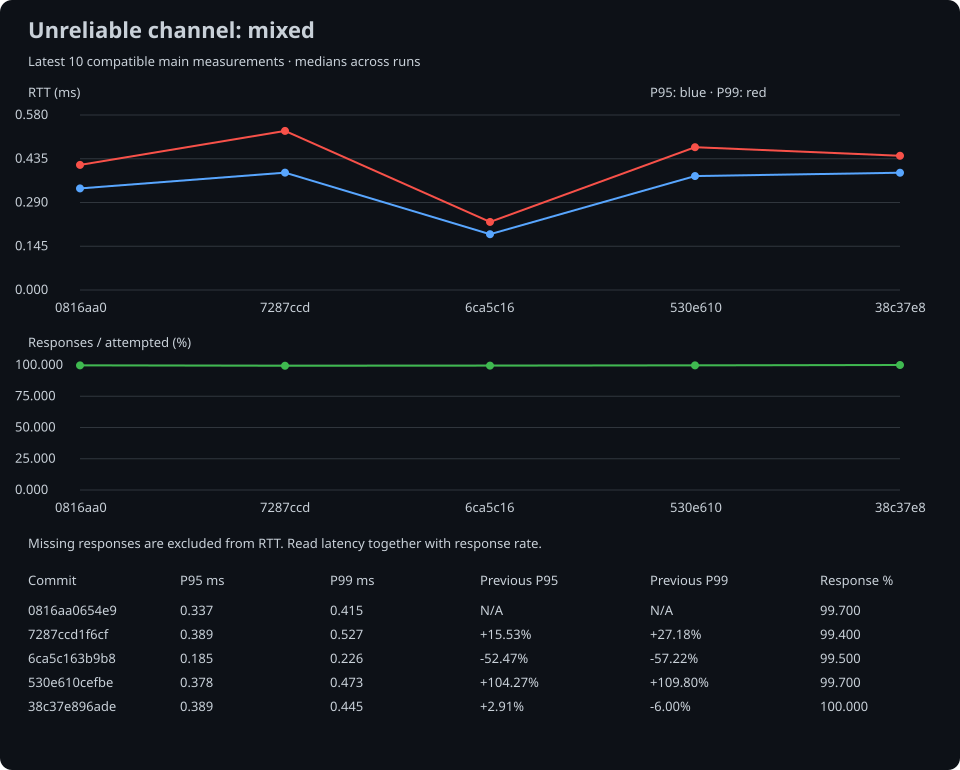

# RTT benchmark history

The JSON file keeps the complete official history. Charts and the table render the latest 10 `main` measurements.

## Packet loss 0%

## BotTester TX/RX loss 10%

## Unreliable channel RTT and response rate

Latest 10 measurements compatible with the latest result in each scenario. Missing responses are excluded from RTT; read latency together with response rate.

[Channel summary](./channel-summary.md) · [Channel history](./channel-history.json)

## Recent measurements

| Date (UTC) | Commit | Commit log | Loss 0% P95 | Loss 0% P99 | TX/RX loss 10% P95 | TX/RX loss 10% P99 |
| --- | --- | --- | ---: | ---: | ---: | ---: |
| 2026-09-21 | `4fbb027` | * 클라이언트 종료·재시작 동시성 및 설정 검증 문제 수정   * reliable 송신의 연결 세대 검증과 버퍼 수명 보호 적용   * 종료 요청과 정리를 분리하고 Stop의 완료 대기 보장   * 재전송 한도 초과를 공통 종료 경로로 연결   * 재시작 시 송신 상태 초기화 및 이전 TLS 자원 해제   * 설정 파일 읽기 실패와 숫자 범위·오버플로 검증   * 재시작·동시 종료·CONNECT ACK 유실 회귀 테스트 추가   * Debug·Release 빌드 및 관련 테스트 통과 | 0.162 ms | 0.201 ms | 32.056 ms | 63.746 ms |
| 2026-09-20 | `48b1829` | * 클라이언트 reliable 송신 대기 큐의 ACK 경합으로 인한 정체 수정   * 콘텐츠 송신을 pending 큐로 통합하고 삽입 후 flush 수행   * 윈도우 확인과 콘텐츠 등록을 직렬화해 중복 슬롯 사용 방지   * outstanding 개수의 BYTE 변환 제거 * TLS 평문 누적 오류 수정 | 0.141 ms | 0.194 ms | 32.441 ms | 67.611 ms |
| 2026-09-20 | `ed19d08` | * 공통 패킷 생성·CI 동기화 검사와 BotTester 구조체·컨테이너 지원 통합   * main 기준 rebase 및 패킷 생성기·문서 충돌 해소   * C++ 스키마 검증과 안전한 역직렬화를 유지하며 C# 중첩 스키마·송신 직렬화 추가   * 순서 기반 패킷 ID·기존 수동 핸들러 보존 및 생성 결과 검사 연결   * C++ 테스트 오브젝트·fixture 타입 충돌 해소와 양쪽 직렬화 회귀 검증 추가 | 0.219 ms | 0.241 ms | 32.352 ms | 64.541 ms |
| 2026-09-20 | `7a88abe` | * 클라이언트 패킷 페이로드 검증 오류 수정 | 0.135 ms | 0.163 ms | 32.626 ms | 64.322 ms |
| 2026-09-19 | `38c37e8` | * 패킷 생성기에서 사용자 정의 구조체를 정의하고, 이를 패킷에서 사용할 수 있도록 수정 | 0.245 ms | 0.295 ms | 33.419 ms | 64.328 ms |
| 2026-09-19 | `530e610` | * 버퍼 컨테이너 추가로 인한 연관 테스트 추가 | 0.229 ms | 0.246 ms | 31.884 ms | 63.922 ms |
| 2026-09-14 | `6ca5c16` | * 비신뢰성 채널 RTT·응답률 추이 그래프 및 README 연동   * 단독·혼합 전송별 P95/P99 RTT와 응답률, 커밋별 변화율 표시   * 동일 측정 조건의 최근 10회 선택 및 응답 없는 RTT 구간 처리   * 공식 벤치마크 CI에서 SVG 자동 생성·저장   * README 및 벤치마크 문서 갱신   * 이력 필터링과 누락 응답 처리 회귀 테스트 추가 | 0.134 ms | 0.150 ms | 32.360 ms | 63.627 ms |
| 2026-09-13 | `7287ccd` | * 멀티스레드 안정성 검증을 위한 야간·수동 CI 추가   * 동시 송수신·연결 해제·세션 풀 회수 및 재사용 통합 테스트 추가   * 케이스별 독립 프로세스 반복 실행과 최초 실패 로그·재현 명령 보존   * 실행 시간 제한 및 timeout 발생 시 자식 프로세스 종료 처리   * 실행기 실패 판정 검증과 안정성 검사 가이드 추가 | 0.231 ms | 0.275 ms | 32.907 ms | 64.873 ms |
| 2026-09-13 | `0816aa0` | * 비신뢰성·혼합 채널 RTT 성능 측정 CI 추가   * 요청 ID 기반 에코 패킷으로 신뢰성·비신뢰성 왕복 측정   * 비신뢰성 단독, 신뢰성 기준 및 혼합 전송 시나리오 추가   * 채널별 RTT p50·p95·p99, 응답률 및 처리량 기록     * 미수신·지연 응답을 RTT 표본과 구분하여 집계   * 이전 커밋 대비 성능 비교와 결과 이력 저장     * PR 요약, Job Summary 및 artifact에 결과 출력     * 지연 변화는 보고하고 응답 불능·연결 종료 등은 실패 처리   * 집계·이력 비교 테스트와 측정 문서 추가 | 0.209 ms | 0.229 ms | 33.397 ms | 65.643 ms |
| 2026-09-13 | `5201fe3` | * 연결 ACK 유실 복구 및 중복 연결 처리 방지   * 서버가 동일 클라이언트의 연결 재요청에 ACK만 재전송하도록 수정     * 접속자 수, 연결 콜백 및 수신 상태 유지     * 다른 주소·포트와 종료 중인 세션의 요청 제외   * 봇 테스터의 최초 연결 전환에서만 연결 콜백과 생존 검사 실행     * 종료 경합 중 연결 상태 복원 방지     * 생존 검사 작업에 취소 토큰을 미리 전달   * 연결 재요청, 중복 ACK 및 종료 경합 회귀 테스트 추가 | 0.224 ms | 0.243 ms | 32.194 ms | 64.317 ms |

Last updated by `4fbb027293364134c4944a878808b243733c609d` at 2026-09-21T21:30:16.1825896+00:00.
