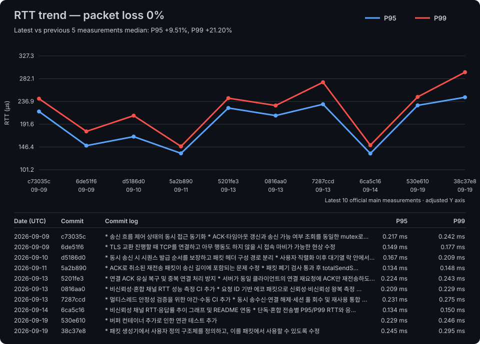
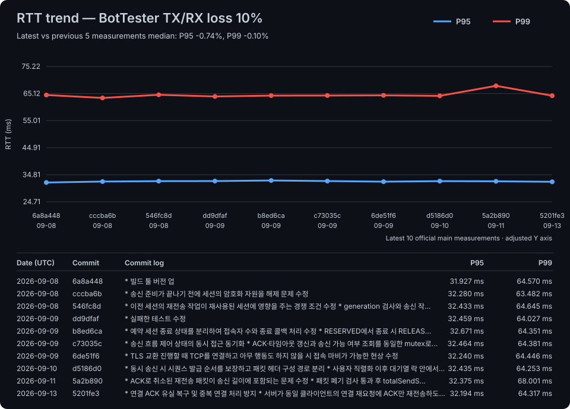

# RTT benchmark history

The JSON file keeps the complete official history. Charts render the latest 10 `main` measurements.

## Packet loss 0%

## BotTester TX/RX loss 10%

Last updated by `03293c8f5918ecf5ff439340d1fb40464d2895f4` at 2026-08-03T10:24:05.601426+00:00.
